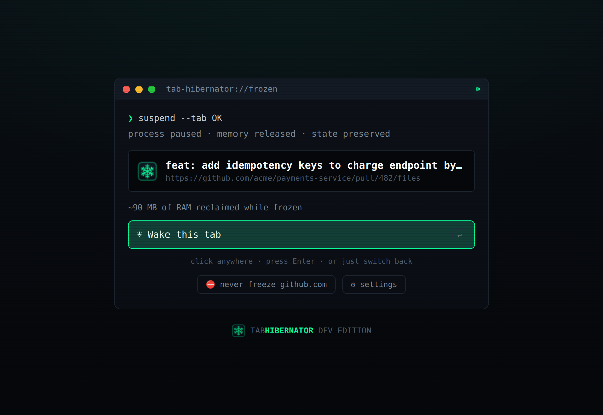
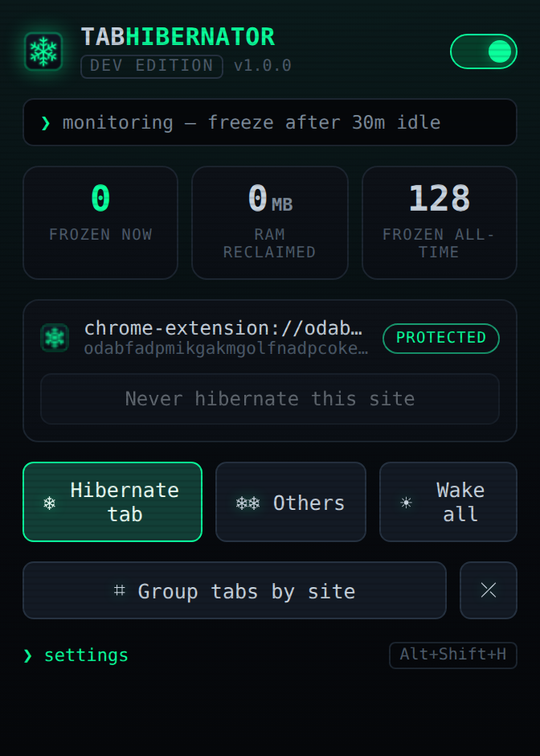
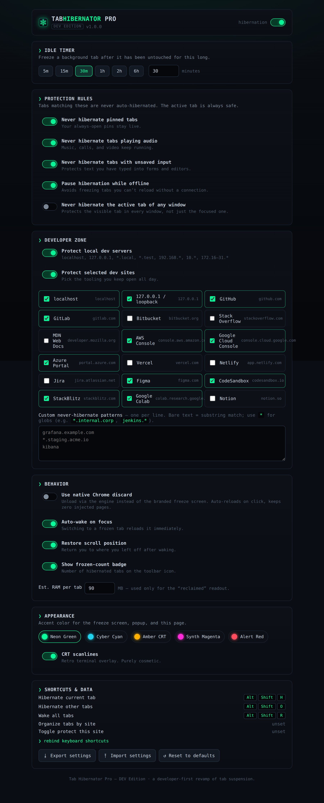

# Tab Hibernator Pro — DEV Edition ❄

A developer-first revamp of tab suspension (the spiritual successor to *The Great
Suspender*). It freezes background tabs you haven't touched in a while to reclaim
RAM — but it's built to **never freeze the things developers keep open**: your
`localhost` dev servers, open PRs, cloud consoles, and any tab where you have
unsaved input.

Dark, terminal-inspired UI. Zero setup. Works for web, app, OS, DB, and
security-review workflows alike.

<p align="center">
  
</p>

---

## Why this one

Most tab suspenders freeze *everything* on a timer and lose your state. This one
knows what a developer's browser looks like:

- 🖥️ **Protects local dev servers automatically** — `localhost`, `127.0.0.1`,
  `0.0.0.0`, `*.local`, `*.test`, and private LAN ranges (`192.168.*`, `10.*`,
  `172.16–31.*`) are never frozen.
- 🧠 **Never loses unsaved work** — a tab with text typed into any form, editor,
  or `contenteditable` is skipped by the auto-freezer.
- 🔧 **Curated dev-site presets** — one-click protect GitHub, GitLab, AWS/GCP/Azure
  consoles, Figma, CodeSandbox, StackBlitz, Colab, and more.
- 🎛️ **Custom patterns** — bare substrings or `*` globs (e.g. `*.staging.acme.io`,
  `jenkins.*`) for your internal tooling.
- 🗂️ **One-click tab organizer** — group the current window's tabs by site into
  native, color-coded tab groups (suspended tabs group by their real domain too).
  One button to group, one to ungroup.
- 🔊 **Respects audio, pinned tabs, and offline** — configurable.
- 💾 **Restores scroll position** when a tab wakes.
- ↩️ **Preserves the original URL & title** so frozen tabs stay recognizable in
  the tab strip and reload exactly where you left them.

## Install (unpacked — 30 seconds)

1. Download or clone this repo.
2. Open `chrome://extensions` in Chrome / Edge / Brave.
3. Toggle **Developer mode** on (top-right).
4. Click **Load unpacked** and select this folder.

That's it — the ❄ icon appears in your toolbar. No build step, no dependencies.

> Requires a Chromium browser (Chrome 116+). Built on Manifest V3.

## Using it

Click the toolbar icon for the control panel:

<p align="center">
  
</p>

- **Hibernate tab / Others / Wake all** — one-click actions.
- **Group tabs by site** — organize the window into tidy, color-coded tab groups
  (and an ungroup button to flatten them again).
- **Never hibernate this site** — protect the current domain instantly.
- Master toggle to pause/resume monitoring.
- Live count of frozen tabs and estimated RAM reclaimed.

### Keyboard shortcuts

| Action | Default |
| --- | --- |
| Hibernate current tab | `Alt+Shift+H` |
| Hibernate other tabs | `Alt+Shift+O` |
| Wake all tabs | `Alt+Shift+R` |
| Toggle protect this site | *(unset — bind at `chrome://extensions/shortcuts`)* |

### Settings

Everything is configurable from the options page — idle timer, protection rules,
the developer zone, behavior (native discard vs. branded freeze screen, auto-wake
on focus, scroll restore, badge), five hacker accent themes, CRT scanlines, and
JSON export/import of your config.

<p align="center">
  
</p>

## How it works

| Piece | Role |
| --- | --- |
| `src/background/service-worker.js` | Tracks per-tab idle time, runs a 1-min scan, applies protection rules, hibernates & wakes tabs, maintains the badge. |
| `src/content/content-script.js` | Detects unsaved form input and reports/restores scroll position. |
| `src/suspended/` | The branded "frozen tab" page that holds the original URL and wakes on click / focus / Enter. |
| `src/popup/` · `src/options/` | The control panel and full settings UI. |
| `src/lib/settings.js` | Defaults, dev-domain presets, and all URL-matching logic. |

Two hibernation strategies are supported: the **branded freeze screen** (default,
full themed UI) or **native `chrome.tabs.discard`** (zero injected pages) — toggle
in settings.

### Permissions, briefly

`tabs` (see/manage tabs), `storage` (settings + stats), `alarms` (periodic scan),
`contextMenus` (right-click actions), and host access for the content script that
detects unsaved input & restores scroll on your pages. No `scripting` permission,
no data ever leaving your browser — there is no network code and no telemetry.

Navigation is locked to `http(s)` only: the freeze screen refuses to restore any
non-web address, so a crafted suspended URL can't run code in the extension.

## Development

```bash
node tools/gen-icons.mjs   # regenerate the icon set (pure Node, no deps)
```

Load the folder unpacked as above and hack away — no bundler or build.

## License

MIT
